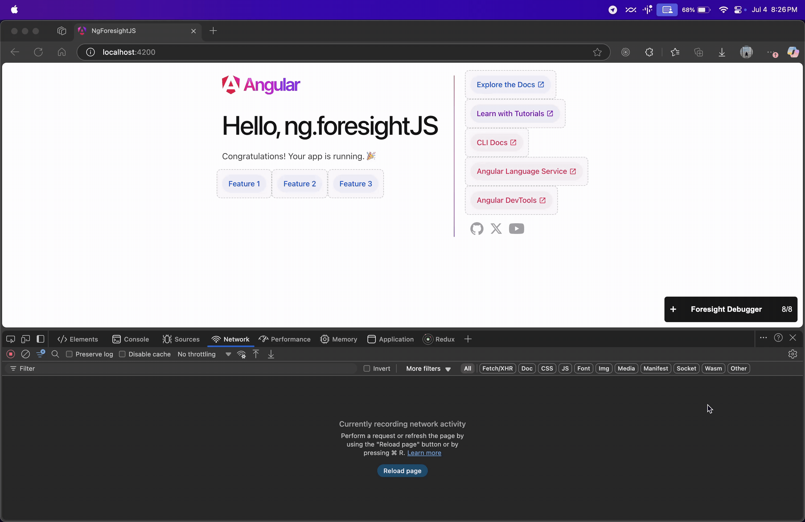

<p align="center">
  
</p>
<br/>
<p align="center">
  <a href="https://www.npmjs.com/package/ngx-foresight">
    
  </a>
  <a href="https://www.npmjs.com/package/ngx-foresight">
    
  </a>
  <a href="https://www.npmjs.com/package/ngx-foresight">
    
  </a>
  <a href="https://github.com/akshykhade/ngx-foresight/blob/main/LICENSE">
    
  </a>
  <a href="https://bundlephobia.com/package/ngx-foresight">
    
  </a>
</p>

# ngx-foresight - [🚀 Demo](https://akshykhade.github.io/ngx-foresight/)

[foresightjs](https://foresightjs.com/) implementation for Angular. It provides router preloading strategy which automatically downloads the lazy-loaded module based on foresightjs prediction of user intent from mouse and keyboard.

[🚀 Demo](https://akshykhade.github.io/ngx-foresight/)

## Usage



## installation

```bash
npm install js.foresight ngx-foresight
npm install -D js.foresight-devtools
# or
pnpm add js.foresight js.foresight-devtools ngx-foresight
pnpm add -D js.foresight-devtools
```

After that import the `ForesightjsDirective` to the components with `href` and `routerLink`, and use the `ForesightjsStrategy` as `preloadingStrategy` in the router's configuration. For example:

```ts
import { ForesightManager } from 'js.foresight';
import { ForesightDevtools } from 'js.foresight-devtools';
import { ForesightjsDirective } from 'ngx-foresight';

ForesightManager.initialize({
  enableMousePrediction: true,
  positionHistorySize: 8,
  trajectoryPredictionTime: 80,
  defaultHitSlop: 10,
  enableTabPrediction: true,
  tabOffset: 3,
  enableScrollPrediction: true,
  scrollMargin: 150,
});

ForesightDevtools.initialize({
  showDebugger: true,
  isControlPanelDefaultMinimized: true, // optional setting which allows you to minimize the control panel on default
  showNameTags: true, // optional setting which shows the name of the element
  sortElementList: 'visibility', // optional setting for how the elements in the control panel are sorted
});
```

```html
<div class="pill-group-horizontal">
  <a href="/feature1" class="pill" registerForesight="Feature 1">Feature 1</a>
  <a href="/feature2" class="pill" registerForesight="Feature 2">Feature 2</a>
  <a href="/feature3" class="pill" registerForesight="Feature 3">Feature 3</a>
</div>
```

```ts
// configure preloading strategy as per routes
  provideRouter(routes, withPreloading(ForesightjsStrategy)),
// for older versions
  RouterModule.forRoot(routes, { preloadingStrategy: ForesightjsStrategy })
```
This library has been tested with Angular 13, but it may also be compatible with older versions. If you encounter any issues with older versions, please report them.

Inspired by [ngx-quicklink](https://github.com/mgechev/ngx-quicklink) 